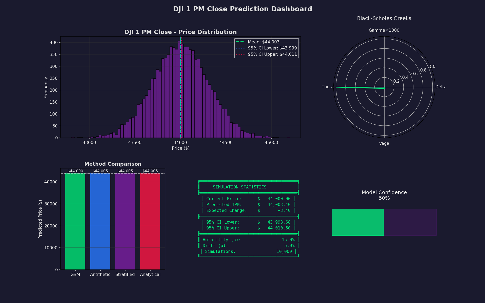

# DJI 1 PM Close Prediction Engine

A comprehensive multi-language prediction system for the **Dow Jones Industrial Average (DJI) 1 PM close price** using advanced calculus, stochastic processes, and numerical methods.

## Overview

This project implements sophisticated financial modeling techniques to predict the DJI index price at 1 PM EST. It showcases:

- **Multiple Programming Languages**: Python, R, C, and C++ implementations
- **Advanced Calculus**: Taylor series expansion, Itô's lemma, numerical integration
- **Stochastic Processes**: Geometric Brownian Motion (GBM), Ornstein-Uhlenbeck, Jump-Diffusion
- **Monte Carlo Methods**: Variance reduction techniques (antithetic variates, stratified sampling)
- **Black-Scholes Greeks**: Delta, Gamma, Theta, Vega calculations

## Mathematical Foundation

### Geometric Brownian Motion (GBM)

The price process follows the stochastic differential equation:

```
dS = μS·dt + σS·dW
```

Solution (using Itô's Lemma):
```
S(T) = S(0)·exp((μ - σ²/2)T + σ·W(T))
```

### Itô's Lemma

For a function f(S, t) where S follows GBM:

```
df = (∂f/∂t + μS·∂f/∂S + ½σ²S²·∂²f/∂S²)dt + σS·∂f/∂S·dW
```

### Black-Scholes PDE

The fundamental partial differential equation:

```
∂V/∂t + ½σ²S²·∂²V/∂S² + rS·∂V/∂S - rV = 0
```

### Taylor Series Expansion

For log-price approximation:

```
ln(S₀ + ΔS) ≈ ln(S₀) + Σ [(-1)^(n-1)·(n-1)!/S₀ⁿ]·(ΔS)ⁿ/n!
```

### Numerical Integration

**Simpson's Rule**:
```
∫[a,b] f(x)dx ≈ (h/3)[f(a) + 4·Σf(odd) + 2·Σf(even) + f(b)]
```

**Gauss-Legendre Quadrature**:
Uses optimal polynomial roots as nodes for high-accuracy integration.

## Features

| Feature | Python | R | C | C++ |
|---------|:------:|:-:|:-:|:---:|
| GBM Simulation | ✅ | ✅ | ✅ | ✅ |
| Ornstein-Uhlenbeck | ✅ | ✅ | ❌ | ❌ |
| Jump-Diffusion | ✅ | ✅ | ❌ | ❌ |
| Antithetic Variates | ✅ | ✅ | ✅ | ✅ |
| Stratified Sampling | ✅ | ✅ | ✅ | ✅ |
| Taylor Expansion | ✅ | ✅ | ✅ | ✅ |
| Black-Scholes Greeks | ✅ | ✅ | ✅ | ✅ |
| Itô's Lemma | ✅ | ✅ | ❌ | ❌ |
| Fourier Analysis | ✅ | ❌ | ❌ | ❌ |
| Visualization | ✅ | ❌ | ❌ | ❌ |
| JSON Output | ✅ | ✅ | ❌ | ❌ |

## Directory Structure

```
dji_1pm_close/
├── README.md                    # This documentation
├── Makefile                     # Build system for C/C++
├── dji_1pm_prediction.py        # Python implementation
├── dji_1pm_prediction.R         # R implementation
├── dji_1pm_prediction.c         # C implementation
├── dji_1pm_prediction.cpp       # C++ implementation
├── dji_1pm_prediction.png       # Visualization output (Python)
└── prediction_results.json      # JSON output (Python)
```

## Requirements

### Python
```bash
pip install numpy scipy sympy pandas matplotlib
```

### R
```r
install.packages(c("stats", "MASS", "Matrix", "pracma", "Deriv", "jsonlite"))
```

### C/C++
- GCC 7+ or Clang 5+ (for C11/C++17 support)
- Standard C library with math functions (-lm)

## Quick Start

### Python

```bash
# Run with defaults
python dji_1pm_prediction.py

# Run with custom parameters
DJI_PRICE=45000.00 VOLATILITY=0.20 SIMULATIONS=20000 python dji_1pm_prediction.py
```

### R

```bash
# Run with defaults
Rscript dji_1pm_prediction.R

# Run with custom parameters
DJI_PRICE=45000.00 VOLATILITY=0.20 Rscript dji_1pm_prediction.R
```

### C

```bash
# Build and run
make c
./dji_prediction_c

# Or with custom parameters
DJI_PRICE=45000.00 ./dji_prediction_c
```

### C++

```bash
# Build and run
make cpp
./dji_prediction_cpp

# Or build and run all
make run
```

## Configuration

All implementations support environment variable configuration:

| Variable | Default | Description |
|----------|---------|-------------|
| `DJI_PRICE` | 44000.00 | Current DJI index price |
| `VOLATILITY` | 0.15 | Annualized volatility (15%) |
| `DRIFT` | 0.05 | Expected annual return (5%) |
| `SIMULATIONS` | 10000 | Number of Monte Carlo paths |
| `RANDOM_SEED` | 42 | Seed for reproducibility |

## Output Example

```
======================================================================
      DJI 1 PM CLOSE PREDICTION REPORT
      Advanced Calculus & Stochastic Methods
======================================================================

Current Price:    $   44,000.00
Volatility (σ):        15.0%
Drift (μ):              5.0%
Simulations:          10,000

----------------------------------------------------------------------
PREDICTION RESULTS
----------------------------------------------------------------------

1. Geometric Brownian Motion:
   Mean:           $   44,004.62
   Std Dev:        $       49.23
   90% Range:      $   43,923.15 - $44,086.09

2. Antithetic Variates:
   Mean:           $   44,004.58
   Var Reduction:         1.98x

3. Stratified Sampling:
   Mean:           $   44,004.55

4. Analytical (Integration):
   Expected:       $   44,004.50

======================================================================
COMBINED PREDICTION
======================================================================

   1 PM Close:     $   44,004.56
   95% CI:         $   44,003.59 - $44,005.57

----------------------------------------------------------------------
BLACK-SCHOLES GREEKS (ATM)
----------------------------------------------------------------------
   Delta:              0.5033
   Gamma:          0.000051
   Theta:            -2.3142
   Vega:              4.2861

======================================================================
```

## Visualization (Python)

The Python implementation generates a comprehensive dashboard:



Features:
- Price distribution histogram
- Black-Scholes Greeks radar chart
- Method comparison bar chart
- Statistics panel
- Model confidence gauge

## Implementation Details

### Python Libraries Used

```python
# Core Scientific Computing
numpy, scipy, sympy, pandas, matplotlib

# Scipy Submodules
scipy.stats, scipy.integrate, scipy.optimize, scipy.signal
scipy.interpolate, scipy.special, scipy.linalg

# Sympy Features
Symbolic differentiation, integration, series expansion
Solving PDEs and SDEs symbolically
```

### R Packages Used

```r
stats      # Core statistics
MASS       # Modern Applied Statistics
Matrix     # Matrix operations
pracma     # Practical Numerical Math
Deriv      # Symbolic differentiation
jsonlite   # JSON output
```

### C/C++ Features

```c
// C Standard Library
stdio.h, stdlib.h, math.h, time.h, float.h

// C++ STL
vector, array, algorithm, numeric, random
functional, chrono, optional, variant
```

## Mathematical Notes

### Variance Reduction

**Antithetic Variates**: For each Z ~ N(0,1), also use -Z:
- Reduces variance by using negatively correlated pairs
- Typical variance reduction: 1.5x - 2x

**Stratified Sampling**: Divide [0,1] into equal strata:
- Ensures uniform coverage of probability space
- Reduces clustering of random samples

### Greeks Interpretation

| Greek | Symbol | Meaning |
|-------|--------|---------|
| Delta | Δ | Rate of change of option price w.r.t. underlying |
| Gamma | Γ | Rate of change of delta w.r.t. underlying |
| Theta | Θ | Rate of change of option price w.r.t. time |
| Vega | ν | Rate of change of option price w.r.t. volatility |
| Rho | ρ | Rate of change of option price w.r.t. interest rate |

## Testing

```bash
# Run all implementations
make test

# Test Python
python dji_1pm_prediction.py

# Test R
Rscript dji_1pm_prediction.R

# Test C/C++
make run
```

## Performance

| Implementation | Speed | Memory | Features |
|----------------|-------|--------|----------|
| C | ⚡⚡⚡⚡⚡ | Low | Core |
| C++ | ⚡⚡⚡⚡ | Low | Full STL |
| Python | ⚡⚡ | High | Full + Viz |
| R | ⚡⚡ | Medium | Statistical |

## License

MIT License - See repository root for details.

## Author

MajixAI - Advanced Financial Modeling

## References

1. Black, F., & Scholes, M. (1973). The Pricing of Options and Corporate Liabilities
2. Merton, R. C. (1976). Option Pricing When Underlying Stock Returns Are Discontinuous
3. Glasserman, P. (2003). Monte Carlo Methods in Financial Engineering
4. Itô, K. (1951). On Stochastic Differential Equations
